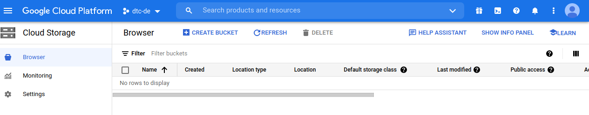
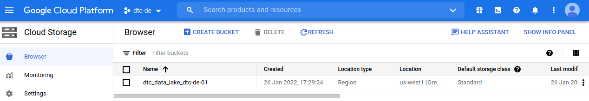
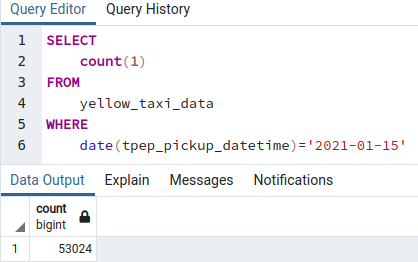
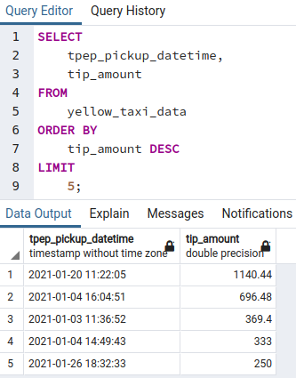
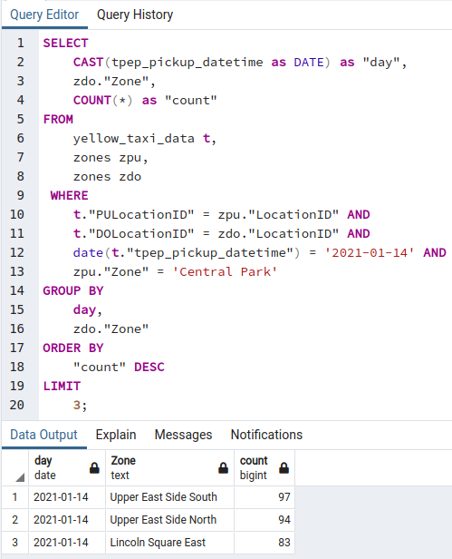
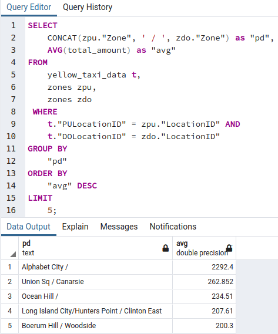

# DEZ Week 1


# Q1

To get the version of glcoud, run

```
gcloud --version
```

we get

```
Google Cloud SDK 369.0.0
```

Note that the latest version is 370, but that was creating some problems on my Pop!_OS machine, so I had to downgrade to make it work.


# Q2

After running, the following commands

```
gcloud auth application-default login
terraform init
terraform plan
terraform apply
```

I get (only last few lines shown)

```
google_bigquery_dataset.dataset: Creating...
google_storage_bucket.data-lake-bucket: Creating...
google_storage_bucket.data-lake-bucket: Creation complete after 3s [id=dtc_data_lake_dtc-de-01]
google_bigquery_dataset.dataset: Creation complete after 4s [id=projects/dtc-de-01/datasets/trips_data_all]

Apply complete! Resources: 2 added, 0 changed, 0 destroyed.
```


Before applying.


After running the apply command.


After running the `terraform destroy` command (to prevent cost being incurred), the resource gets deleted


# Q3

```
SELECT 
	count(1)
FROM
	yellow_taxi_data
WHERE
	date(tpep_pickup_datetime)='2021-01-15'
```




# Q4

```
SELECT 
	tpep_pickup_datetime,
	tip_amount
FROM
	yellow_taxi_data
ORDER BY
	tip_amount DESC
LIMIT
	5;
```



# Q5

Incorrect submission! 

```
SELECT 
   	CAST(tpep_pickup_datetime as DATE) as "day",
 	zdo."Zone",
	COUNT(*) as "count"
FROM
	yellow_taxi_data t,
 	zones zpu,
 	zones zdo
 WHERE
 	t."PULocationID" = zpu."LocationID" AND
 	t."DOLocationID" = zdo."LocationID" AND
 	date(t."tpep_pickup_datetime") = '2021-01-14' AND
   	zpu."Zone" = 'Central Park'
GROUP BY
	day,
	zdo."Zone"
ORDER BY
	"count" DESC
LIMIT 
	3;
```




# Q6

Incorrect submission! 


```
SELECT
	CONCAT(zpu."Zone", ' / ', zdo."Zone") as "pd",
	AVG(total_amount) as "avg"
FROM
	yellow_taxi_data t,
 	zones zpu,
 	zones zdo
 WHERE
 	t."PULocationID" = zpu."LocationID" AND
 	t."DOLocationID" = zdo."LocationID"
GROUP BY
	"pd"
ORDER BY
	"avg" DESC
LIMIT 
	5;
```


 

